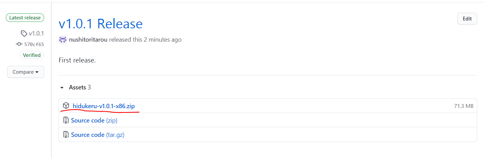
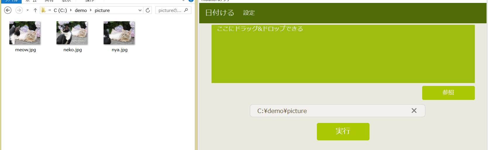
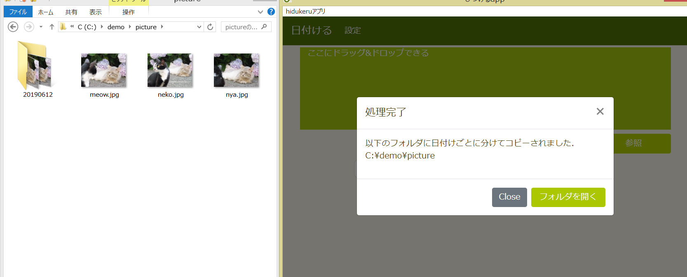
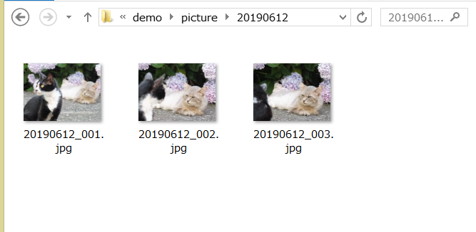

# hidukeru
このソフトウェアはJPG画像から撮影日を取得し，撮影日ごとにフォルダ分け，リネームを行います．

This software renames JPG images and divides them into directories according to the shooting date.

## 環境(Dependency)
- electron:12.0.5
- electron-builder:22.10.5
- bootstrap:4.6.0
- exif-reader:1.0.3
- jquery:3.6.0
- sharp:0.28.1

## Setup
環境：windows8 or 10

1. [リリース](https://github.com/nushitoritarou/hidukeru/releases/)から任意のバージョンのzipファイルをダウンロード．

2. ダウンロードしたzipファイルを解凍し，中に入っている`hidukeru Setup {version}.exe`を実行．

## 使い方(Usage)
1. ソフトウェアを起動し，『ここにドラッグ＆ドロップできる』と書かれたエリアに対象のファイル，フォルダをドラッグアンドドロップ，もしくは参照ボタンから選択を行う．  
(Start the software and drag and drop the target file or folder to the area where "ここにドラッグ＆ドロップできる", or select from the button labeled "参照".)

2. 実行ボタンを押す．処理が終わるとモーダルが出てくる．『フォルダを開く』ボタンを押すことで出力先のフォルダを開くことができる．  
(Press the button labeled "実行". When the process is finished, a modal will appear.You can open the output destination directory by clicking the "フォルダを開く" button.)

3. 実行完了．
(completed.)

設定については[こちら](about_config.md)  
([click here for information about setting.](about_config_EN.md))

## License

MIT License
