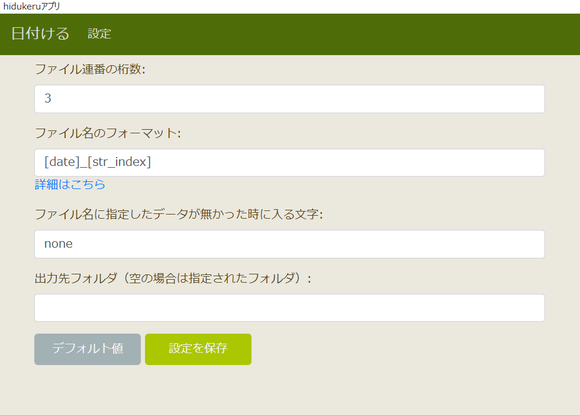
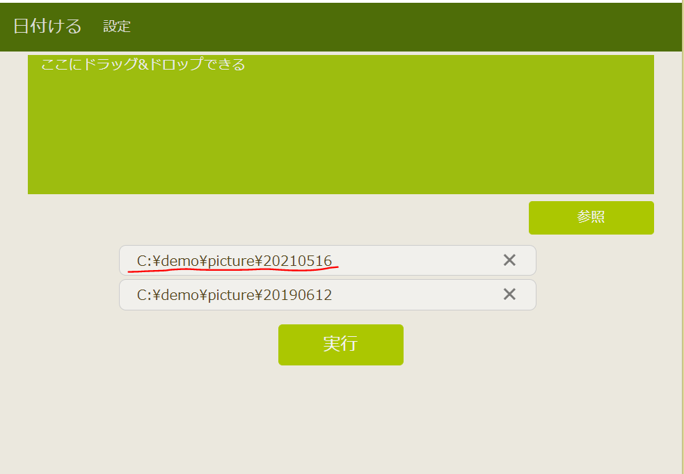

## 設定画面について
[English version](about_config_EN.md)
hidukeruではナビゲーションバーの『設定』ボタンを押すことで，設定画面を開くことができる．

・設定画面

-------

以下では設定の各項目について説明する．

### ファイル連番の桁数
ここでは出力される画像ファイルの名前の中の，連番の桁数を決めることができる．

例：
2020年01月01日に2番目に撮影された写真の場合
設定値：3 `20200101_002`
設定値：5 `20200101_00002`

### ファイル名のフォーマット
ここでは出力されるファイル名を変更することができる．
`[]`でくくられた部分は特別な意味を持ち，撮影日，撮影したカメラのモデルなどの情報を埋め込むことができる．

|      埋め込む情報      |       プロパティ       |
| :--------------------: | :--------------------: |
|         撮影日         |        `[date]`        |
| 何番目に撮影した写真か |     `[str_index]`      |
|    カメラのメーカー    | `[exif][image][Make]`  |
|    カメラのモデル名    | `[exif][image][Model]` |

例：
2020年01月01日に3番目にiphone6で撮影された写真の場合
ファイル名のフォーマットの設定値：`[date]_[str_index]_[exif][image][Make]_[exif][image][Model]_test`
ファイル名：`20200101_003_Apple_iPhone 6_test`

### ファイル名に指定したデータが無かった時に入る文字
ここでは，ファイル名のフォーマットで指定した情報を取得できなかった時にどのような文字に置き換えるかを設定することができる．

例：
2020年01月01日に3番目に撮影された写真の場合(撮影したカメラの情報が入っていない)
ファイル名のフォーマットの設定値：`[date]_[str_index]_[exif][image][Make]_[exif][image][Model]_test`
ファイル名に指定したデータが無かった時に入る文字の設定値：`しっぱい`
ファイル名：`20200101_003_しっぱい_しっぱい_test`

### 出力先フォルダ
ここでは処理を行った画像をどこに保存するか設定することができる．
特に設定していない場合，初めに指定したフォルダに保存される．

例：
`C:\demo\picture\output`に保存したい場合
設定値：`C:\demo\picture\output`