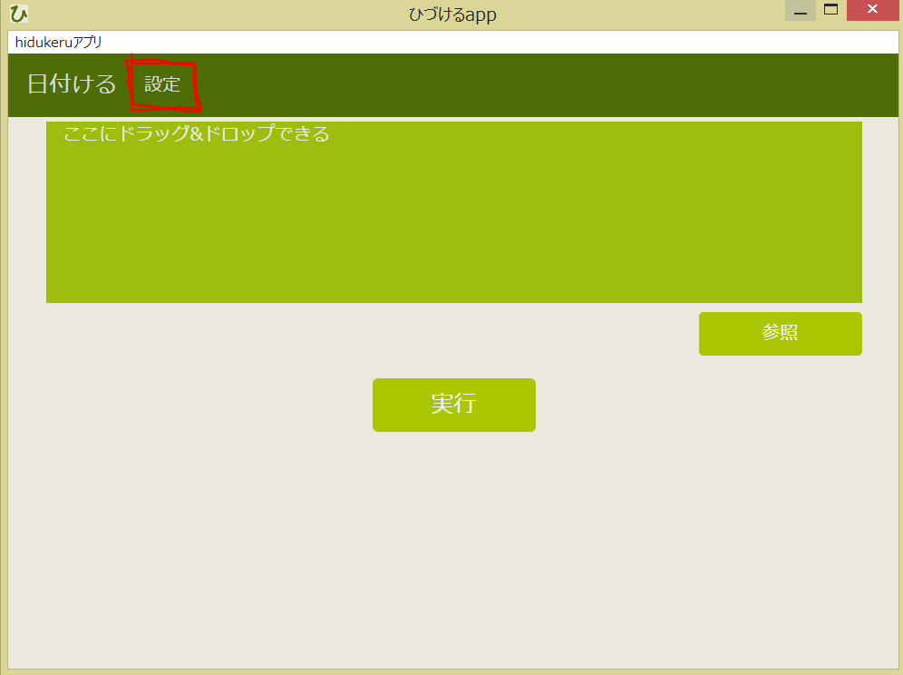
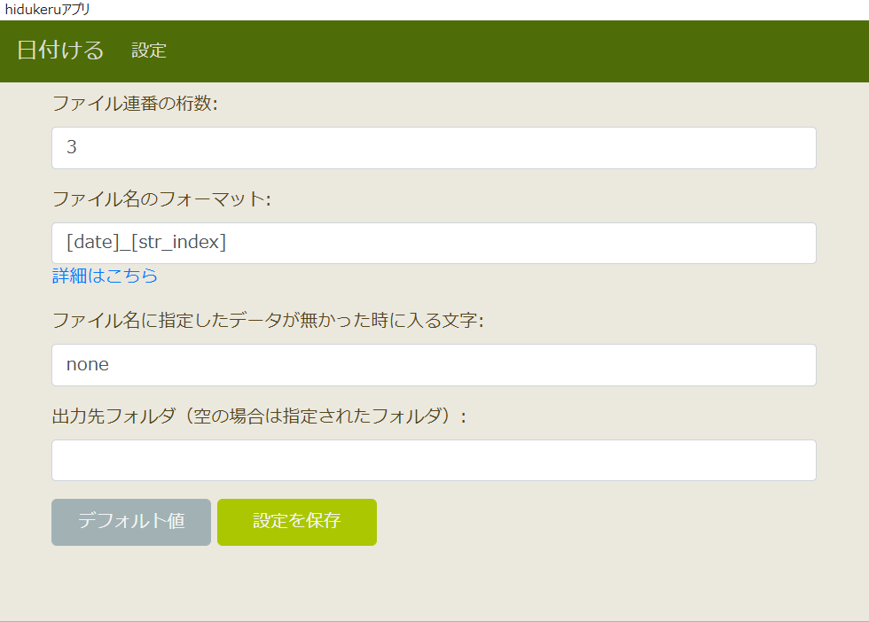

## About Config
[日本語バージョン](about_config.md)
You can open the setting page by pressing the button labeld "設定" on navigation bar.

・Setting page

-------

Each setting is explained below.

### Number of digits(ファイル連番の桁数)
In this form, you can determine the number of digits of the serial number in the name of the output image file.

Example：  
Second photo taken on January 01, 2020  
Number of digits：3 `20200101_002`  
Number of digits：5 `20200101_00002 ` 

### File name format(ファイル名のフォーマット)
In this form, you can set the output file name.  
The part enclosed by `[]` has a special meaning.
They have information such as the shooting date and the model of the camera that shot it.

|      Information      |       Words       |
| :--------------------: | :--------------------: |
|    Shooting date   |        `[date]`        |
| index of file(1st,2nd,3rd...) |     `[str_index]`      |
|    Camera maker   | `[exif][image][Make]`  |
|    Camera model    | `[exif][image][Model]` |

Example：  
Third photo taken with iphone 6 on January 01, 2020  
File name format：`[date]_[str_index]_[exif][image][Make]_[exif][image][Model]_test`  
Actual file name：`20200101_003_Apple_iPhone 6_test`  

### Character when it fails(ファイル名に指定したデータが無かった時に入る文字)
In this form, you can set what kind of characters to replace when the information specified in the file name format cannot be obtained.

Example：  
Third photo taken on January 01, 2020 (without camera information)  
File name format：`[date]_[str_index]_[exif][image][Make]_[exif][image][Model]_test `   
Character when it fails：`FAIL`  
Actual file name：`20200101_003_FAIL_FAIL_test`  

### Output directory(出力先フォルダ)
In this form, you can set where to save the processed image.
If not set, it will be saved in the folder specified at the beginning.

Example：  
When you want to save to `C: \ demo \ picture \ output`  
set `C:\demo\picture\output`  

